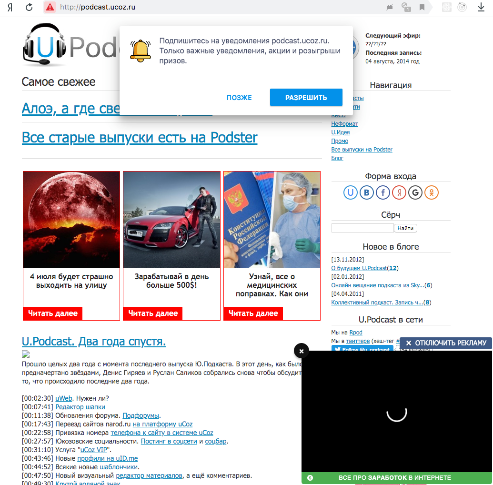

---

title: "upodcast.git"
summary: "Про новую архивную версию сайта подкаста"

slug: "last"

date: "2020-07-01 21:45:06"

author: "DPolyakov"

id: "blog_last"

categories:

 - Новости подкаста

---

Примерно раз в год, каждый раз после продления домена, я заходил на сайт подкаста понастальгировать. И каждый раз меня встречала ещё более «клёвая» реклама.

В этом году я собрал бинго: автовоспроизведение видео со звуком, подписка на пуши и врезка с диким кликбейтом.

За такое немножко стыдно, потому что сайт всё же наш с Русланом, оплачивать премиум для снятия рекламы на архивном сайте как-то не хочется. Можно было снести конечно всё, но [я обещал этого не делать](/blog/o_budushhem_u_podcast/2012-11-12-8/#comment3342).

В итоге я перенес практически весь текстовый контент в статику. Теперь всё живет в репозитории на [гитхабе](https://github.com/upodcast/site). Собирается с помощью [Hugo](https://gohugo.io). А хостится на [Netlify](https://netlify.com). 

За прошедшее время мы продолбали несколько аудиодорожек, например 1, 6, 9 и 56 выпуск. Поэтому если они у вас чудесным образом сохранились, то напишите нам в твиттер или ишью на гитхабе.

Вообще с интернетом итория очень забавная.  
В 2010-ом я думал что вэб по большей части стабилен, и если уж проект появился, то он в том или ином виде будет жить. 

Но большинство ссылок из наших шоунотов сейчас ведут примерно никуда, а проекты, которые мы обсуждали, позакрывались почти все.

Вообщем, спасибо [uCoz](https://ucoz.ru/), это было приколькое время и интересный опыт.

`git commit -m "💾 upodcast" && git push`