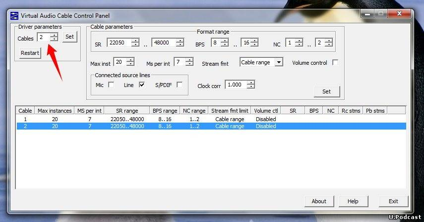
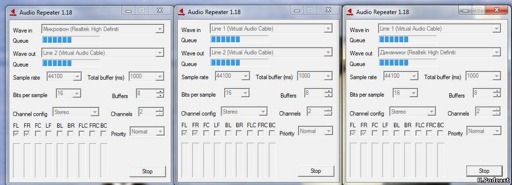
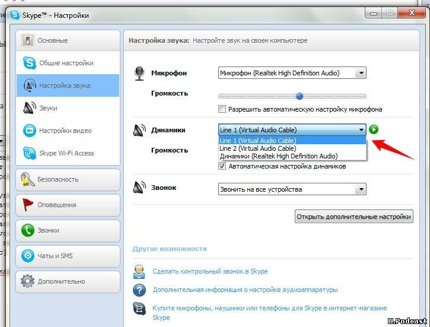
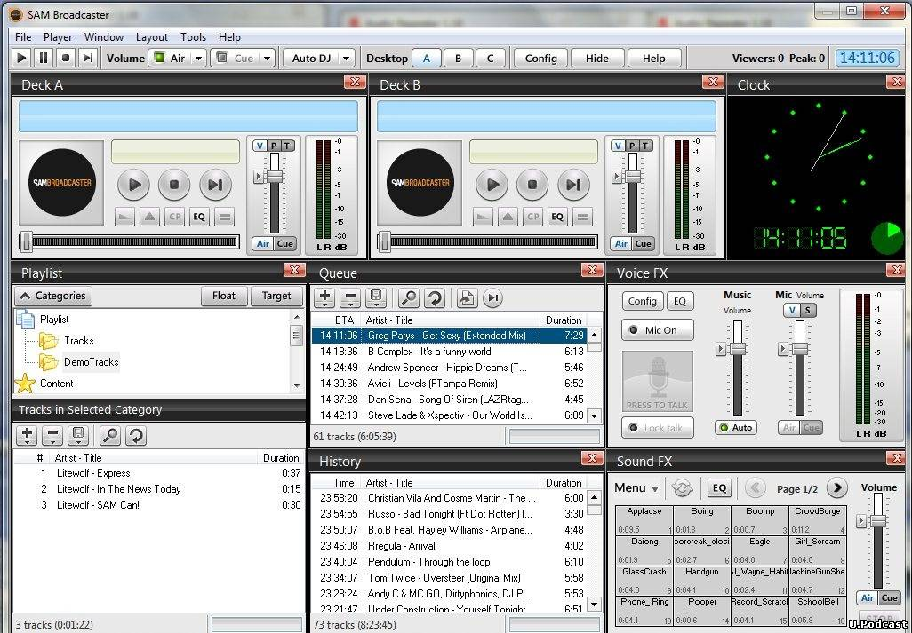
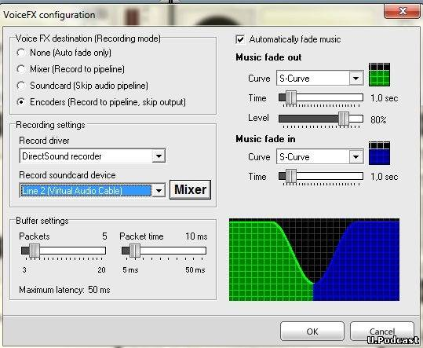
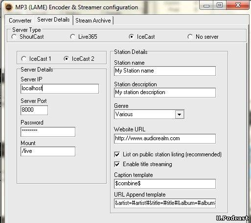
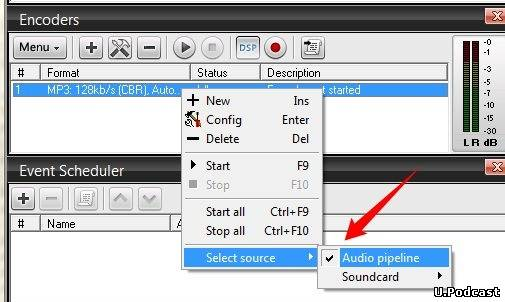
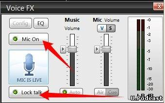

---

title: "Онлайн вещание подкаста из Skype"

slug: "onlajn_veshhanie_podkasta_iz_skype/2012-01-02-6"

date: "2012-01-02 12:28:16"

author: "TERNOX"

id: "blog_2012-01-02-6"

categories:

 - Советы подкастерам

---
Записывать и выкладывать подкасты — круто, однако ещё круче, если Ваши подкасты будут транслироваться онлайн на какой-то страничке сайта (например, [как у нас](index/0-9)). Итак, начинаем.  
  

### Больше звука!

  
Дабы не покупать ещё одну звуковую карту, мы можем [скачать бесплатный эмулятор звуковых карт](https://vac.muzychenko.net).  
Запускаем _vcctlpan.exe_ из архива, ищем Driver Parameters - Cables - устанавливаем на два, щёлкаем по Set.  

  
Попытаюсь объяснить, зачем это нам. Дело в том, что нам нужно, что бы в эфир шло два потока:  
1\. Звук из вашего микрофона  
2\. Звук из Скайпа  
С помощью эмулятора мы сможем объединить эти две дорожки и пустить их в эфир, не допустив того, что вы будете слышать сами себя в наушниках. Непонятно? Дальше лучше.  
  

### Раз! Два! Три!

  
Теперь три раза запускаем приложение _audiorepeater.exe_ из того же архива. И настраиваем точно так, как на скриншоте:  

### Готовим Скайп

  
Нам нужно пустить звук из скайпа на эмулируемую звуковую карту #1. Для этого заходим в настройка звука Скайпа, выбираем Динамики - Line 1.  

  
Сохраняем, идём дальше.  
  

### А как вещать?

  
Теперь самое интересное. Мы для вещания используем программу SAM Broadcaster.  

  
Ищем окно Voice FX, щёлкаем Config, настраиваем по скриншоту:  

  
Ищем окно Encoders, нажимаем на плюс и добавляем свою станцию, а точнее её данные. Мы используем для вещания сетевую программу IceCast 2.  

  
Для того, что бы вещать, не обязательно иметь собственный сервер (которым с нами любезно делится Дима), можно создать свою "радиостанцию", где вам предоставят данные для вещания, как правило, такие услуги не бесплатные. Из проверенных, могу посоветовать [myradio24](http://myradio24.com/), а [moeradio](http://moeradio.ru/) давал подобные услуги бесплатно, однако временно бесплатное вещание приостановлено. Там же вы сможете найти и коды для ваших плееров. Запускаем вещания, прежде нажав правую кнопку мыши на вашем потоке, и убедившись, что там всё так:  

  
Запускаем звук:  

  
  

### Ура!

  
Вы в эфире! Если вы хотите фоновую музыку, накидайте её в Queue. Если у вас что-то не получается или есть какие-то вопросы - пишите в комменты, мы попробуем ответить, если знаем ответ, конечно:)