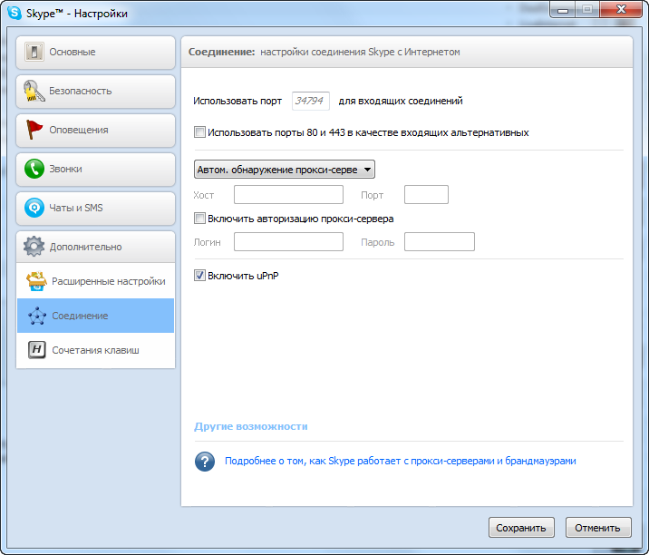

---

title: "Коллективный подкаст. Запись через Skype"

slug: "kollektivnyj_podkast_zapis_cherez_skype/2011-04-04-3"

date: "2011-04-03 23:03:44"

author: "DPolyakov"

id: "blog_2011-04-03-3"

categories:

 - Советы подкастерам

---
Как я уже говорил в [первом посте](/blog/zapis_podkasta_s_chego_nachat/2011-03-13-1) этого блога, одной из разновидностей подкаста является коллективный подкаст. Его обычно записывают в виде интервью или беседы участников на заданные темы. Таковым является и наш [U.Podcast](//upodcast.ru/).  
Идеальный вариант такого подкаста — запись всех участников в студии. Нов 99% случаев такой вариант не возможен. И тут приходит на помощь Skype, или другой сервис, позволяющий связать голосом двух или более людей. Мы остановились на скайпе.  
  
Вариантов записи коллективного подкаста через скайп 2: это записывать всю беседу одному человеку или каждому участнику записывать свою дорожку, а потом их сводить вместе. У обоих вариантов свои трудности.  
  

### Один за всех  

У варианта записи одним человеком главный недостаток — отсутствие гарантий хорошего качества связи. Думаю не секрет, что перед записью стоит выключить все торренты и другие «качалки», выгнать родных с ютуба со второго компа :), ну вообщем всячески освободить канал. И даже после всех проделанных манипуляций гарантий нет. Кроме того, если вы используете роутер, то стоит прописать в настройках Port Forwarding вашего роутера проброс порта, который использует скайп. Я точно не помню какой протокол используется UDP или TCP, поэтому пробросил оба. На сколько я понял, номер порта всегда разный, его можно узнать в настройках:  
Рекомендую это сделать, в любом случае качество нам понадобится для бекапов.  
  

  

### Каждый сам за себя  

У второго варианта, а именно записи дорожки каждым из участников тоже есть трудности. Во-первых — каждому новому гостю нужно объяснить как установить и настроить софт для записи. Но это не главное. Главное потом это все смонтировать. Многие выпуски меня выручала аудасити, сейчас я перешел на более функциональную Adobe Audition.  
  
Второй вариант мне кажется более приемлемым из-за практически 100% гарантии хорошего качества дорожки. Но тут есть еще один нюанс...  
  

### Бекапы

Бекапы это важно :) Согласитесь, неприятно узнать после часа записи, что кто-то забыл нажать кнопочку записи или у кого-то закончилось место на диске и программа решила дальше дорожку не записывать. Именно в таких случаях выручит бекап. Самым простым вариантом является использование [iFree Skype Recorder](http://www.ifree-recorder.com/ "http://www.ifree-recorder.com/"). Бесплатная программка обладает всем необходимым функционалом. В настройках можно выбрать что именно записывать: входящий звонок, вашу дорожку или всё сразу, а так же в каком формате: стерео или моно, и в каком битрейте.  

Отмечу что в режиме стерео ваша дорожка будет в одном канале, дорожка коллег(и) «по ту сторону скайпа» в другом. Для гостей можно выбрать вариант записи только своей дорожки, человеку, который будет все это добро монтировать я бы советовал поставить режим стерео. Так проще сориентироваться при монтаже, а на последнем этапе просто преобразовать в дорожку в моно, выделив только канал с речью собеседников. Таким способом был спасен не один выпуск юподкаста.
